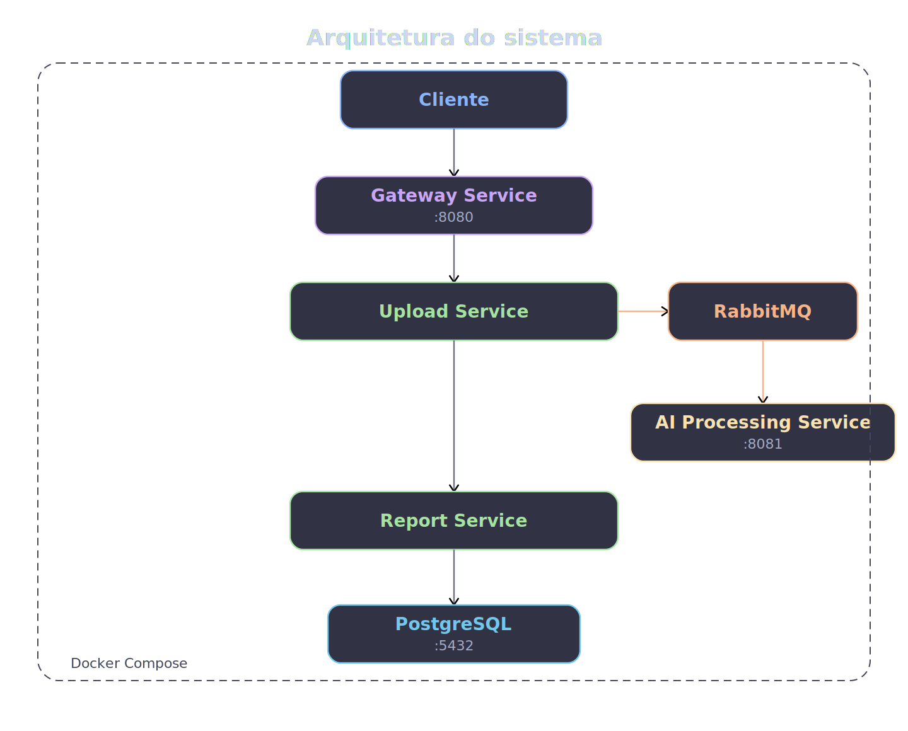

# Hackathon FIAP - Análise Inteligente de Arquitetura de Sistemas

## Sobre o Projeto

Este projeto foi desenvolvido para o Hackathon FIAP utilizando arquitetura de microsserviços com Java Spring Boot, RabbitMQ, PostgreSQL, Docker e API Gateway.

O sistema permite realizar upload de diagramas ou arquivos de arquitetura de sistemas, enviar os dados para processamento assíncrono via RabbitMQ e gerar análises automáticas contendo:

- Componentes identificados
- Possíveis riscos
- Recomendações de melhoria
- Status do processamento

---

##  Arquitetura do Projeto



O sistema foi dividido em 4 microsserviços:

| Serviço | Responsabilidade |
|---|---|
| upload-service | Recebe uploads e envia mensagens para fila |
| ai-processing-service | Processa os dados e salva análises |
| report-service | Disponibiliza os relatórios |
| gateway-service | Centraliza acesso aos endpoints |

---

## Tecnologias Utilizadas

### Backend
- Java 21
- Spring Boot 3
- Spring Data JPA
- Spring AMQP
- Spring Cloud Gateway

### Banco de Dados
- PostgreSQL

### Mensageria
- RabbitMQ

### Infraestrutura
- Docker
- Docker Compose

### Documentação
- Swagger OpenAPI

---

##  Estrutura do Projeto

```txt
hackathon-fiap
│
├── upload-service
├── ai-processing-service
├── report-service
├── gateway-service
├── docs/
│   └── architecture.png
├── docker-compose.yml
└── README.md
```

---

##  Fluxo da Aplicação

1. O usuário realiza upload de um arquivo
2. O `upload-service` envia uma mensagem para o RabbitMQ
3. O `ai-processing-service` consome a fila
4. A análise é processada
5. O resultado é salvo no PostgreSQL
6. O `report-service` disponibiliza os relatórios
7. O `gateway-service` centraliza os acessos

---

##  Executando com Docker

### Pré-requisitos

- Docker Desktop
- Java 21
- Maven

###  Gerar os JARs

Na raiz do projeto:

```bash
mvn clean package
```

###  Subir containers

```bash
docker compose up --build
```

---

##  Serviços Disponíveis

| Serviço | Porta |
|---|---|
| Gateway | 8080 |
| Upload Service | 8082 |
| AI Processing Service | 8081 |
| Report Service | 8083 |
| PostgreSQL | 5432 |
| RabbitMQ | 5672 |
| RabbitMQ Management | 15672 |

---

##  Swagger

### Upload Service

```txt
http://localhost:8082/swagger-ui.html
```

### Report Service

```txt
http://localhost:8083/swagger-ui.html
```

---

##  RabbitMQ

### Painel Web

```txt
http://localhost:15672
```

### Login

```txt
user: guest
password: guest
```

---

##  Exemplo de Resposta

```json
{
  "id": 15,
  "fileName": "novo-diagrama.pdf",
  "status": "DONE",
  "components": "API Gateway\nPostgreSQL\nRabbitMQ\nMicroservices",
  "risks": "Ponto único de falha\nFalta de redundância",
  "recommendations": "Adicionar balanceamento\nImplementar replicação"
}
```

---

##  Segurança

O projeto utiliza:

- API Gateway
- Separação de responsabilidades
- Processamento assíncrono
- Containers isolados
- Persistência em banco relacional

---


##  Integrantes do Grupo
-   Nathan
-   Denys
-   Fernanda

  ##  Referências

-   FIAP -- Pós IA para Desenvolvedores

  ##  Links 

Git Hub: https://github.com/oliveiradenys/Hackaton_Integrado

Youtube: https://www.youtube.com/watch?v=L5CMw22oQxA
